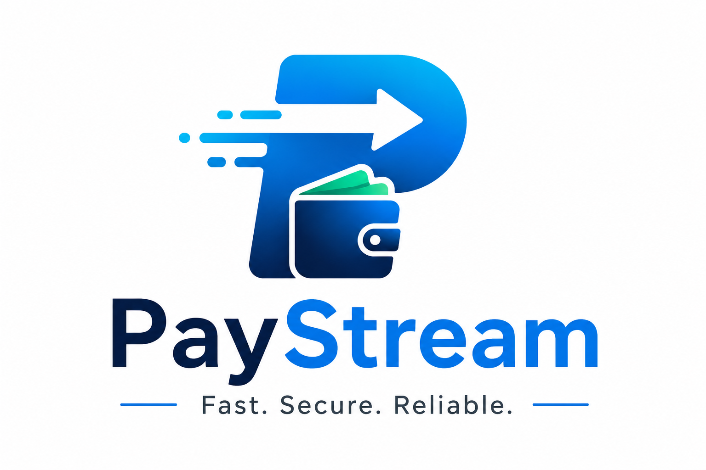
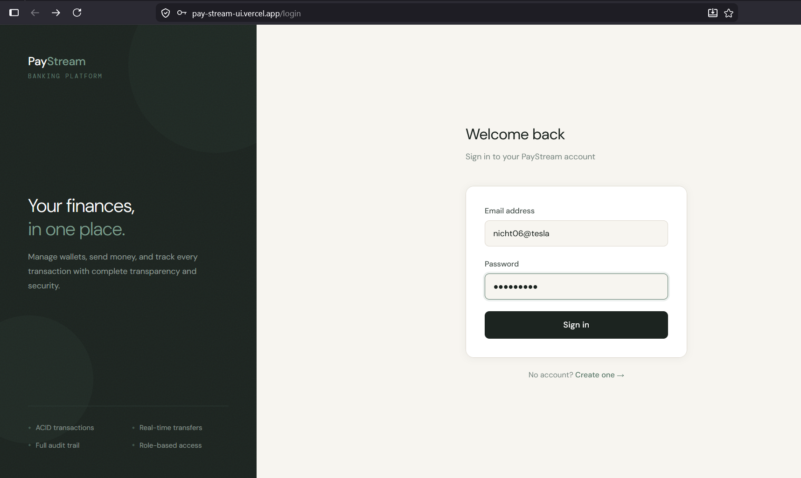
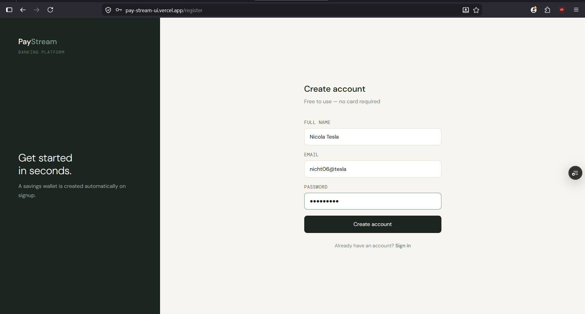
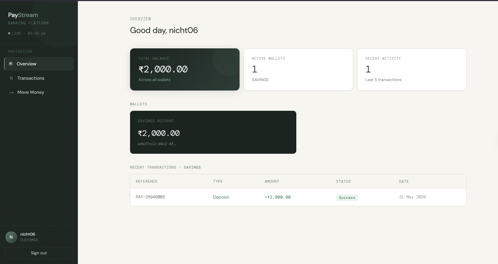
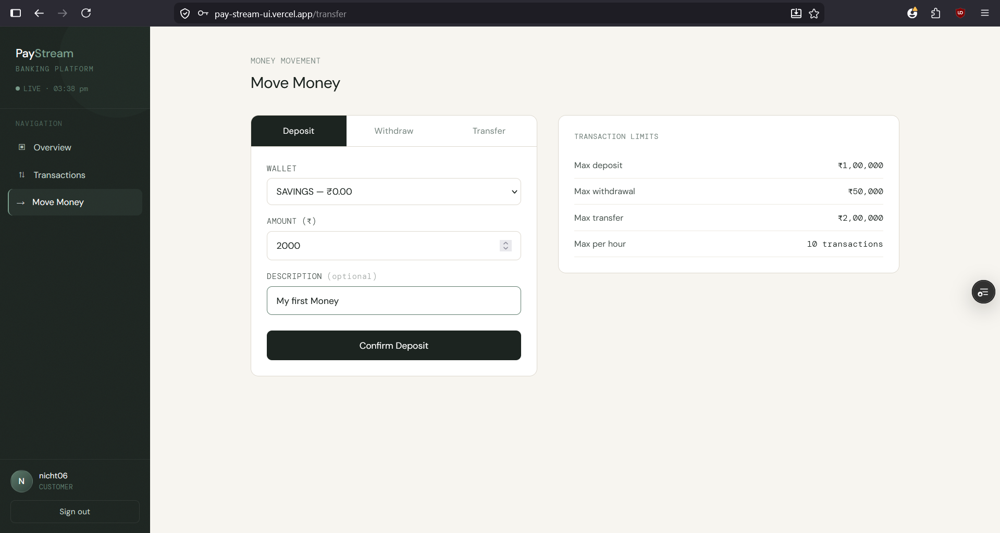
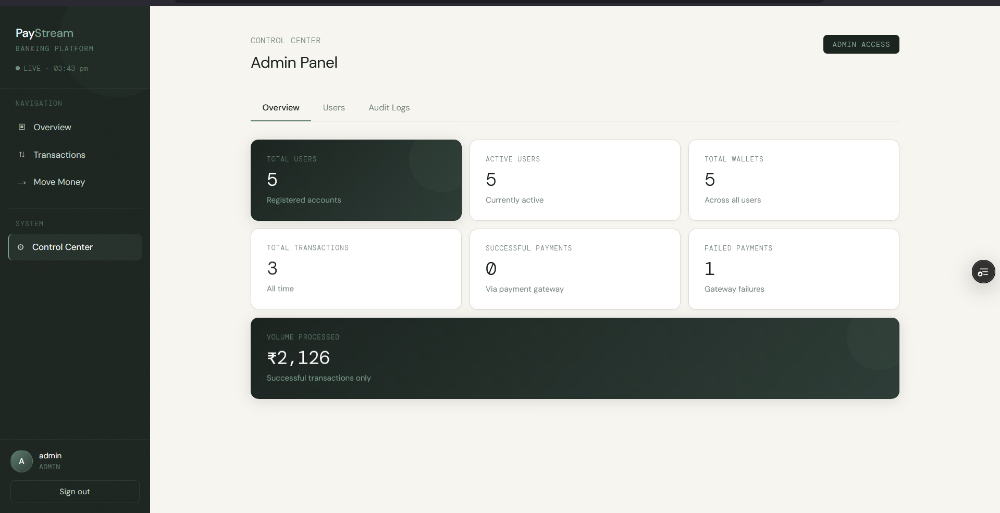

# PayStream UI 🎨

> Modern React dashboard for the PayStream payment orchestration platform.

<p align="center">
  
</p>

<p align="center">
  <a href="https://react.dev">
    
  </a>
  <a href="https://vitejs.dev">
    
  </a>
  <a href="https://tailwindcss.com">
    
  </a>
  
</p>

---

## 🚀 Live Demo

🔗 https://pay-stream-ui.vercel.app/

## 💸 Backend API

🔗 https://github.com/ArnavTambe06/paystream-api

---

## 📖 Overview

PayStream UI is the frontend dashboard for the PayStream payment orchestration platform.

It provides a clean and responsive interface for:

- User authentication
- Wallet management
- Transaction history
- Money transfers
- Administrative operations

Built using React, Zustand, Axios, and Tailwind CSS.

---

## ✨ Features

### Authentication

- Secure JWT login
- User registration
- Protected routes
- Persistent authentication

### Wallet Management

- View wallet balances
- Real-time account information
- Multiple wallet support

### Transactions

- Deposit funds
- Withdraw funds
- Peer-to-peer transfers
- Transaction history

### Administration

- User management
- Audit visibility
- System monitoring

### UI/UX

- Responsive design
- Dark theme
- Modern dashboard layout
- Fast client-side routing

---

## 📸 Application Screenshots

### Login

<p align="center">
  
</p>

<p align="center">
  <em>Secure JWT-based authentication.</em>
</p>

---

### Register

<p align="center">
  
</p>

<p align="center">
  <em>User onboarding with validation.</em>
</p>

---

### User Dashboard

<p align="center">
  
</p>

<p align="center">
  <em>Wallet overview and account summary.</em>
</p>

---

### Transactions

<p align="center">
  
</p>

<p align="center">
  <em>Transaction history with detailed records.</em>
</p>

---

### Admin Dashboard

<p align="center">
  
</p>

<p align="center">
  <em>Administrative controls and operational insights.</em>
</p>

---

## 🛠 Tech Stack

| Category         | Technology      |
| ---------------- | --------------- |
| Framework        | React 18        |
| Build Tool       | Vite            |
| Styling          | Tailwind CSS    |
| State Management | Zustand         |
| HTTP Client      | Axios           |
| Routing          | React Router v6 |
| Deployment       | Vercel          |

---

## ⚙️ Setup

### Clone Repository

```bash
git clone https://github.com/ArnavTambe06/paystream-ui.git
cd paystream-ui
```

### Install Dependencies

```bash
npm install
```

### Configure Environment

Create `.env.local`

```env
VITE_API_BASE_URL=https://your-backend-url
```

### Start Development Server

```bash
npm run dev
```

---

## 📁 Project Structure

```text
src/
├── api/
│   └── Axios instance + interceptors
│
├── store/
│   └── Zustand authentication store
│
├── pages/
│   ├── Login
│   ├── Register
│   ├── Dashboard
│   ├── Transactions
│   └── Admin
│
├── components/
│   ├── Layout
│   ├── ProtectedRoute
│   ├── StatCard
│   └── TransactionTable
│
└── App.jsx
```

---

## 📌 Future Enhancements

- Payment gateway integration
- Real-time notifications
- Analytics dashboard
- Advanced transaction filters
- User profile management

---

## 👨‍💻 Author

**Arnav Tambe**

- GitHub: https://github.com/ArnavTambe06
- LinkedIn: https://linkedin.com/in/arnavtambe06

---

<p align="center">
  Built with React ⚛️, Tailwind 🎨, and a passion for backend engineering 🚀
</p>
